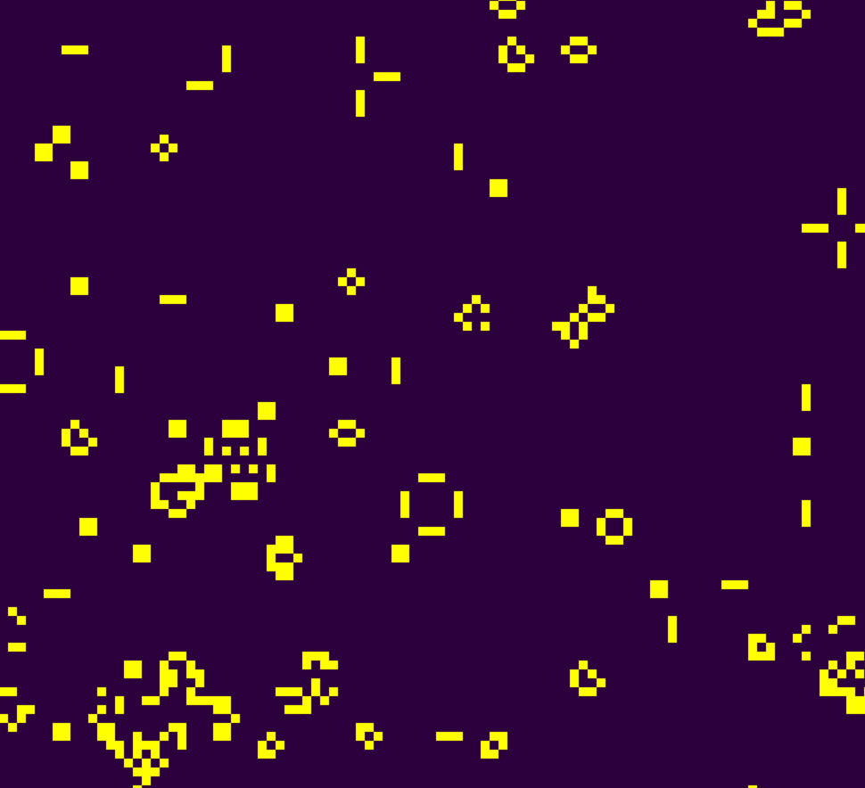

# Laboratorio 2 - Conway's Game of Life

Implementacion en Rust de Conway's Game of Life con renderizado en tiempo real sobre un framebuffer logico de 100 x 100 celdas, escalado a una ventana de 800 x 800 pixeles.

## Objetivo academico

Practicar renderizado en tiempo real, manipulacion de pixeles, lectura del estado de una celda, actualizacion por frames, uso de framebuffer y simulacion de automatas celulares.

## Reglas de Conway

- Una celula viva con menos de dos vecinos vivos muere por subpoblacion.
- Una celula viva con dos o tres vecinos vivos sobrevive.
- Una celula viva con mas de tres vecinos vivos muere por sobrepoblacion.
- Una celula muerta con exactamente tres vecinos vivos nace por reproduccion.

Cada celula revisa sus ocho vecinos y nunca se cuenta a si misma.

## Arquitectura

- `src/framebuffer.rs`: define `Framebuffer`, `point`, `set_current_color` y `get_color`.
- `src/game_of_life.rs`: contiene el estado actual/siguiente, las reglas, conteo de vecinos y renderizado con `point`.
- `src/patterns.rs`: define organismos clasicos y la composicion inicial.
- `src/main.rs`: crea la ventana, procesa controles, temporiza generaciones y muestra el framebuffer.

## Resolucion y colores

- Framebuffer logico: 100 x 100.
- Ventana fisica: 800 x 800.
- Escala visual: 8x.
- Celula muerta/fondo: morado oscuro `0x2B003D`.
- Celula viva: amarillo `0xFFFF00`.

## Bordes wrap-around

Los bordes estan conectados. Una celula en el borde izquierdo considera vecinas las celulas del borde derecho, y lo mismo ocurre verticalmente. Esto se implementa con `rem_euclid` para evitar accesos fuera de rango.

## Patrones incluidos

- Block
- Beehive
- Loaf
- Boat
- Tub
- Blinker
- Toad
- Beacon
- Glider
- Lightweight spaceship (LWSS)
- Pulsar

## Controles

- `Escape`: cerrar.
- `Space`: pausar o reanudar.
- `R`: reiniciar el patron inicial.
- `N`: avanzar una generacion cuando esta pausado.
- `Flecha arriba`: aumentar velocidad.
- `Flecha abajo`: disminuir velocidad.

## Requisitos

- Rust
- Cargo

## Instalacion y ejecucion

```bash
git clone https://github.com/YayaG2805/Lab2Graficas.git
cd Lab2Graficas
cargo run --release
```

## Pruebas

```bash
cargo test
```

## Validaciones de calidad

```bash
cargo fmt --check
cargo clippy --all-targets --all-features -- -D warnings
cargo build --release
```

## Demostracion



El GIF debe mostrar la compilacion, la ejecucion y la simulacion funcionando durante varios segundos. Debe grabarse manualmente y guardarse como `assets/game-of-life.gif`.

## Autor

Diego Guevara
